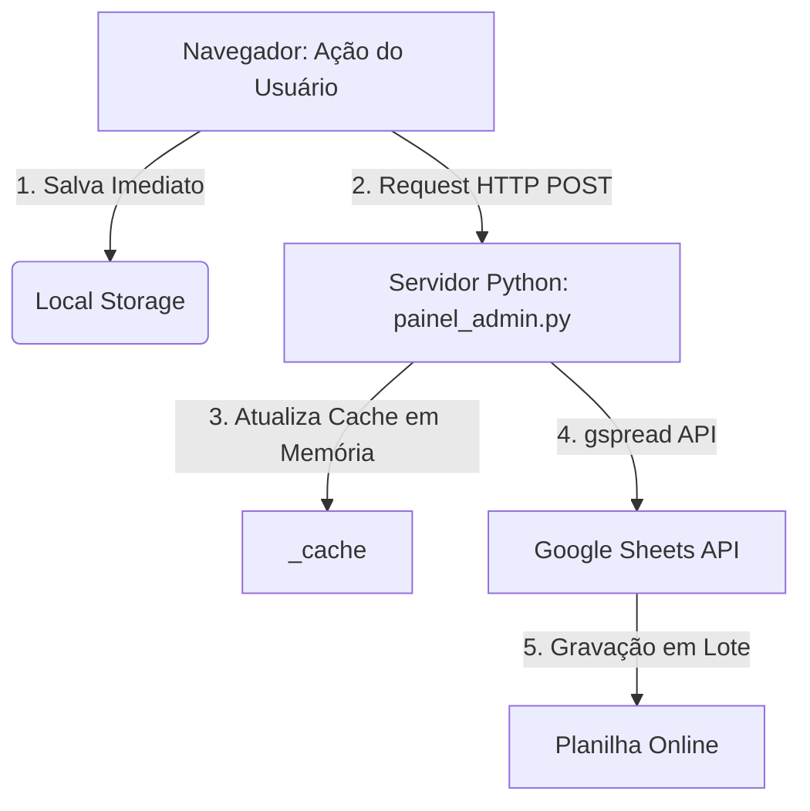

# Documentação de Integração: Liquidações & Google Sheets (SAG 2026)

Este documento detalha o funcionamento interno do registro de liquidações no Setor Financeiro / Tesouraria e a mecânica de sincronização bidirecional e mesclagem de células com o Google Sheets, gerenciada pelo backend em Python.

---

## 🗂️ 1. Estrutura de Colunas (Layout da Planilha)

A planilha do Google Sheets é estruturada com 20 colunas (de `A` a `T`):

| Letra | Nome da Coluna | Tipo de Dado | Descrição |
|:---:|---|---|---|
| **A** | `ID` | Texto | ID exclusivo gerado no client seguido do usuário entre parênteses: `id_registro (nome_usuario)` |
| **B** | `Tipo` | Texto | Tipo de DH: `NP`, `AV`, `DT`, ou `FL` |
| **C** | `N°` | Texto | Número do Documento Hábil |
| **D** | `Data Emissao` | Data | Data de emissão contábil no formato `YYYY-MM-DD` |
| **E** | `Optante` | Texto | Se a empresa é optante pelo Simples: `Sim`, `Não` ou `N/A` |
| **F** | `Valor Bruto` | Decimal | Valor bruto total do documento |
| **G** | `Base de Cálculo` | Decimal | Base de cálculo da dedução específica |
| **H** | `Código Retenção` | Texto | Código de retenção da dedução (ex: `6147`) |
| **I** | `Valor Retenção` | Decimal | Valor retido para a dedução correspondente |
| **J** | `Total Deducoes` | Decimal | Soma de todos os valores retidos para esta liquidação |
| **K** | `Valor Liquido` | Decimal | Valor líquido final (`Valor Bruto` - `Total Deducoes`) |
| **L** | `Cod Natureza` | Texto | Código de natureza de rendimento (bloqueado se Optante = Sim) |
| **M** | `Doc Relacionado` | Texto | Documento de origem anexado (geralmente Nota Fiscal, ex: `NF 21984`) |
| **N** | `CNPJ` | Texto | CNPJ do credor / favorecido |
| **O** | `Data OB` | Data | Data de emissão da Ordem Bancária correspondente |
| **P** | `GERCOMP` | Texto | Badge indicativo preenchido como `"GERCOMP/GEROP"` caso a `Data OB` esteja preenchida |
| **Q** | `E-CAC` | Texto | Status de inclusão no sistema E-CAC: `Sim` ou `Não` |
| **R** | `Observacao` | Texto | Observações manuais inseridas pelo operador (sempre em branco no auto-preenchimento) |
| **S** | `Fase` | Inteiro | Fase interna de processamento do documento |
| **T** | `Updated At` | Timestamp | Data e hora da última modificação do registro |

---

## 🔄 2. O Fluxo de Sincronização

A sincronização é híbrida e bidirecional (entre LocalStorage, Cache Local do Servidor e Google Sheets):

### Gravação e Reconstrução (`rebuild_uge_sheet_sync`)
Toda vez que uma liquidação é adicionada, alterada ou excluída:
1. **Filtro por UGE:** O cache é filtrado para a UGE correspondente (`160443` ou `167443`).
2. **Ordenação:** Os registros são ordenados decrescentemente por data de emissão contábil (e por número de DH) de modo que os lançamentos mais recentes fiquem no topo da planilha. Lançamentos com data em branco são colocados no final.
3. **Limpeza e Escrita:** A aba correspondente na planilha é totalmente limpa (`ws.clear()`) e os novos dados são inseridos em lote (`ws.update(values=rows)`), reduzindo o consumo de cota da API do Google.

---

## 📊 3. Tratamento de Múltiplas Deduções (Mesclagem)

Uma única liquidação pode conter até 4 deduções independentes (por exemplo, retenções de IR, CSLL, COFINS e PIS). O sistema lida com isso de forma relacional utilizando linhas consecutivas mescladas:

### Layout de Linhas Consecutivas
* Se uma liquidação possui **2 deduções**, ela ocupará **2 linhas** na planilha:
  * **Linha 1:** Todos os dados da liquidação são preenchidos nas colunas `A`-`F` e `J`-`T`. As colunas `G`, `H`, e `I` recebem a **primeira dedução**.
  * **Linha 2:** As colunas da liquidação (`A`-`F` e `J`-`T`) ficam **vazias** (nulas), e as colunas `G`, `H`, e `I` recebem a **segunda dedução**.

### Mesclagem Visual Automática via gspread
Para manter a legibilidade, o backend emite um comando de mesclagem em lote (`batch_update`) utilizando as coordenadas das linhas:
* As colunas pertencentes aos dados gerais da liquidação são mescladas verticalmente entre a primeira linha do registro e a última linha de suas deduções (`mergeType: "MERGE_ALL"`).
* Antes de aplicar novas mesclagens, o script limpa todas as mesclagens antigas (`unmergeCells`) para evitar sobreposições ou erros na planilha.

---

## 📥 4. Leitura do Google Sheets para o Cache

Ao iniciar o servidor ou realizar uma sincronização manual, o python lê a planilha online de volta para o cache através do método `parse_merged_rows`:
1. Varre a planilha linha por linha.
2. Se a primeira célula da linha (`Coluna A - ID`) estiver preenchida, o sistema cria um novo registro de liquidação.
3. Se a primeira célula da linha estiver vazia, mas houver dados de dedução nas colunas `G`, `H`, ou `I`, o sistema entende que se trata de uma dedução adicional pertencente à liquidação da linha anterior e a anexa à array `deducoes` daquele objeto.
