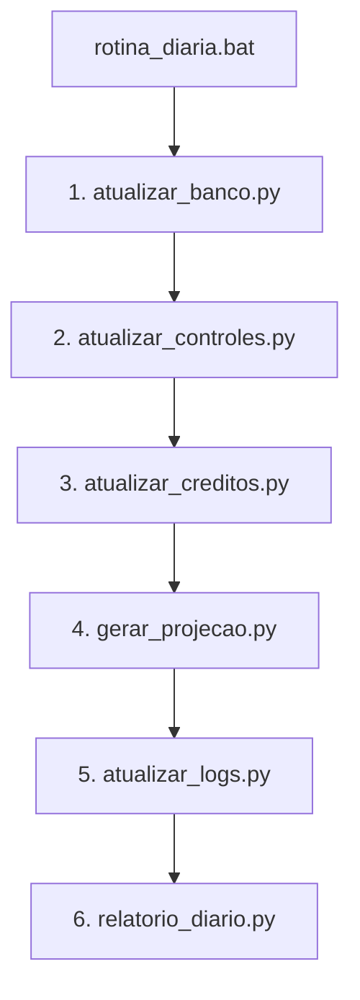

# Manual de Funcionamento dos Scripts da Rotina Diária (ADM63BI)

Este manual serve como guia de referência técnica para entender a ordem cronológica, a funcionalidade de cada script da rotina diária, o fluxo de cruzamento de dados e as regras de negócio integradas à automação da planilha do 63º Batalhão de Infantaria (ADM63BI).

---

## 1. Ordem Cronológica de Execução

O arquivo [rotina_diaria.bat](file:///c:/Users/guilh/Desktop/ADM63BI/rotina_diaria.bat) é responsável por orquestrar a execução automática sequencial de todos os scripts diariamente. A ordem exata de execução e a função resumida de cada etapa são descritas abaixo:



1. **[atualizar_banco.py](file:///c:/Users/guilh/Desktop/ADM63BI/atualizar_banco.py)**: Extrai os dados mais recentes do sistema SAG (Saldos, Empenhos e NCs) e os insere como base bruta na aba `BANCO` da planilha Google Sheets.
2. **[atualizar_controles.py](file:///c:/Users/guilh/Desktop/ADM63BI/atualizar_controles.py)**: Lê a aba `BANCO`, calcula a idade (dias) dos empenhos ativos, mapeia os responsáveis e atualiza as abas `Controle EMP 26` (Exercício Corrente) e `Controle EMP RPNP` aplicando a lógica de abatimento.
3. **[atualizar_creditos.py](file:///c:/Users/guilh/Desktop/ADM63BI/atualizar_creditos.py)**: Cruza o saldo disponível na UG com as Notas de Créditos (NCs) detalhadas na aba `BANCO`, atualizando a aba `Créditos na tela` com agrupamento de merges e coloração de prazos.
4. **[gerar_projecao.py](file:///c:/Users/guilh/Desktop/ADM63BI/gerar_projecao.py)**: Lê o estado das previsões (LOGS e Controles) e gera um arquivo HTML estático interativo (`projecao.html`) com o painel de projeção orçamentária para visualização no navegador.
5. **[atualizar_logs.py](file:///c:/Users/guilh/Desktop/ADM63BI/atualizar_logs.py)**: Grava uma "fotografia" (snapshot) diária dos empenhos e créditos na aba `LOGS`, realiza o bootstrap histórico da coluna K de previsão e executa a verificação secundária de abatimento de parciais.
6. **[relatorio_diario.py](file:///c:/Users/guilh/Desktop/ADM63BI/relatorio_diario.py)**: Dispara uma interface Tkinter para configuração das metas e e-mails dos setores e envia por Gmail o status personalizado de empenhos, créditos, alertas e novas NCs para cada chefe de setor.

---

## 2. Detalhes de Cada Script

### 2.1. [atualizar_banco.py](file:///c:/Users/guilh/Desktop/ADM63BI/atualizar_banco.py)
* **Objetivo**: Limpar e preencher todas as seções de dados brutos na aba `BANCO`.
* **Entradas**:
  - Credenciais do SAG (CPF, Senha, Usuário) configurados no script.
  - Endpoints do SAG para chamada AJAX: `saldos_basicos.php`, `docNcuq1.php` e `docNeuq1.php`.
* **Saídas (Google Sheets - Aba: BANCO)**:
  - `A3:I1000`: Disponível UG 160443.
  - `K3:S1000`: Disponível UG 167443.
  - `U3:AB2000`: Notas de Crédito Detalhadas (NCs) otimizadas com 8 colunas para ambas as UGs.
  - `AD3:AM4`: Resumo do Exercício Corrente (UGs 160443 e 167443).
  - `AD8:AS9`: Resumo do RPNP (Restos a Pagar Não Processados).
  - `AU3:AZ1000`: Empenhos do Exercício Corrente Unificados.
  - `BB3:BG1000`: Empenhos do RPNP Unificados (busca também tipos reais via SAG 2025).
* **Funcionalidade Chave**: Faz bypass de downloads de arquivos ZIP pesados obtendo os dados via requisições diretas (AJAX JSON) às APIs internas do SAG, otimizando o tempo de execução.

### 2.2. [atualizar_controles.py](file:///c:/Users/guilh/Desktop/ADM63BI/atualizar_controles.py)
* **Objetivo**: Gerenciar as abas `Controle EMP 26` e `Controle EMP RPNP`, mantendo colunas inseridas manualmente pelo usuário atreladas à Nota de Empenho (NE) correspondente.
* **Entradas**:
  - Aba `BANCO` (`AU3:AZ1000` para Corrente e `BB3:BG1000` para RPNP).
  - Estado atual da própria aba de controle antes da atualização (para recuperar observações, previsão H/R e parcial I/S inseridas pelo usuário).
* **Saídas (Google Sheets - Abas: Controle EMP 26 / Controle EMP RPNP)**:
  - Atualização das colunas `A:I` (UG 160443) e `K:S` (UG 167443).
  - Registro de log local em `snapshots/mudancas_previsao.json` e snapshot temporário em `snapshots/previsao_snapshot.json` para detectar alterações nas previsões de um dia para o outro.
* **Regra de Ordenação**: Os dados são ordenados por **Setor Responsável** (ordem alfabética) e, secundariamente, pela **Idade do Empenho** (Dias) de forma decrescente (mais antigos no topo).
* **Mapeamento de Setor**: Utiliza o dicionário `RESPONSAVEL_MAP` para vincular o prefixo do PI da NE ao setor correspondente (Ex: `I3DACSPCORR` -> Fiscalização).

### 2.3. [atualizar_creditos.py](file:///c:/Users/guilh/Desktop/ADM63BI/atualizar_creditos.py)
* **Objetivo**: Apresentar os saldos de créditos disponíveis cruzados com as Notas de Créditos detalhadas na aba `Créditos na tela`.
* **Entradas**:
  - Aba `BANCO` (Seções de Disponível UG 160443 em `A3:I` e UG 167443 em `K3:S`).
  - Aba `BANCO` (Seção de NCs em `U3:AB2000`).
  - Estado anterior de `Créditos na tela` para preservar as colunas manuais "Prazo OM" (colunas I/W) e "Providência" (colunas M/AA).
* **Saídas (Google Sheets - Aba: Créditos na tela)**:
  - Escreve dados em `A3:M1000` (UG 160443) e `O3:AA1000` (UG 167443).
  - Executa merges automáticos de colunas e colore as linhas via API em lote (`batch_update`).
* **Lógica de NCs Recentes**: Identifica novas NCs emitidas nos últimos 3 dias (`_nc_dentro_de_dias`). Se houver nova NC ou se for um crédito novo, o script reconstrói o bloco associado àquela chave `(ug, pi, nd)`, inserindo uma linha por NC para detalhamento. Se não houver novas NCs e o crédito já existia, preserva o grupo original sem alteração de formatação.

### 2.4. [gerar_projecao.py](file:///c:/Users/guilh/Desktop/ADM63BI/gerar_projecao.py)
* **Objetivo**: Exportar a base orçamentária e a auditoria de previsões para o dashboard dinâmico de projeção.
* **Entradas**:
  - Abas `LOGS`, `Controle EMP 26`, `Controle EMP RPNP`, `Créditos na tela` e `BANCO`.
  - Configuração de metas de e local de data da meta ([config_notificacoes.json](file:///c:/Users/guilh/Desktop/ADM63BI/auth/config_notificacoes.json)).
  - Log local de mudanças de previsão ([mudancas_previsao.json](file:///c:/Users/guilh/Desktop/ADM63BI/snapshots/mudancas_previsao.json)).
* **Saídas**:
  - `projecao.html`: Arquivo HTML interativo com design premium contendo gráficos e tabelas para acompanhamento de liquidação e auditoria das previsões.
* **Cálculo da Auditoria**: Executa a lógica de auditoria de metas, avaliando o comportamento do saldo de cada empenho frente à marcação (SIM, PARCIAL, NÃO) do usuário.

### 2.5. [atualizar_logs.py](file:///c:/Users/guilh/Desktop/ADM63BI/atualizar_logs.py)
* **Objetivo**: Criar o histórico diário de todos os saldos e previsões, essencial para o histórico de novidades de empenhos e relatórios.
* **Entradas**:
  - Abas `Controle EMP 26`, `Controle EMP RPNP` e `Créditos na tela`.
* **Saídas (Google Sheets - Aba: LOGS)**:
  - Limpa os registros já inseridos na data atual (caso o script seja rodado mais de uma vez no mesmo dia, evitando duplicidade) e grava no final da planilha o log estruturado em 11 colunas: `[Timestamp, Data, Categoria, UG, Responsável, PI, ND, NE, Valor Principal, Valor Previsão, Previsão]`.
  - Formata as colunas de valor como moeda ("R$ #,##0.00").
* **Bootstrap**: Preenche automaticamente a coluna K (Previsão) em linhas de dias anteriores caso estejam vazias, utilizando o status atual da NE como retroativo (rodado em migrações).

### 2.6. [relatorio_diario.py](file:///c:/Users/guilh/Desktop/ADM63BI/relatorio_diario.py)
* **Objetivo**: Gerenciar as metas e contatos dos chefes de setores e enviar o boletim diário de pendências.
* **Entradas**:
  - [config_notificacoes.json](file:///c:/Users/guilh/Desktop/ADM63BI/auth/config_notificacoes.json) (Contatos de e-mail e metas percentuais).
  - Todas as abas de dados da planilha Google Sheets.
* **Saídas**:
  - Interface Tkinter (GUI) que permite preencher os e-mails e metas de liquidação de cada setor e salvar de volta no JSON.
  - Envio de e-mails via API do Gmail.
* **Tipos de E-mail**:
  - **Setorial**: Contém a projeção do setor, empenhos ordinários com mais de 40 dias, novas NCs recebidas e créditos na tela pendentes de providência.
  - **Fiscalização (Premium/Global)**: Destinado ao setor de Fiscalização. Além de seus próprios dados, inclui o **Overview Geral do Batalhão** contendo empenhos ordinários vencidos de todos os setores, créditos vencidos/atenção de todos, novos empenhos de todos nos últimos 3 dias, novas NCs de todos nos últimos 3 dias e a tabela de velocidade de liquidação diária por setor dos últimos 5 dias.

---

## 3. Fluxo e Cruzamento de Informações

O diagrama abaixo descreve detalhadamente como os dados trafegam e se cruzam entre as abas do Google Sheets e arquivos locais em cada etapa da rotina:

```
                  ┌───────────────┐
                  │   SAG (Web)   │
                  └───────┬───────┘
                          │ (Extrator direto API)
                          ▼
                  ┌───────────────┐
                  │  Aba BANCO    ├───────────────────────┐
                  └──────┬────────┘                       │
                         │ (AU:AZ / BB:BG)                │ (A:I / K:S / U:AB)
                         ▼                                ▼
  ┌───────────────┐      ┌─────────────────────────┐      ┌─────────────────────────┐
  │Snapshots Locais│ ◄───┤Abas Controles (EMP/RPNP)│      │  Aba Créditos na tela   │
  └───────────────┘      └───────────┬─────────────┘      └───────────┬─────────────┘
                                     │                                │
                                     └──────────────┬─────────────────┘
                                                    │ (Fotografia ativa diária)
                                                    ▼
                                            ┌───────────────┐
                                            │   Aba LOGS    │
                                            └───────┬───────┘
                                                    │
                                                    ├─────────────────────────┐
                                                    ▼                         ▼
                                            ┌───────────────┐         ┌───────────────┐
                                            │ gerar_projecao│         │relatorio_diari│
                                            └───────┬───────┘         └───────┬───────┘
                                                    ▼                         ▼
                                            ┌───────────────┐         ┌───────────────┐
                                            │ projecao.html │         │ E-mails Gmail │
                                            └───────────────┘         └───────────────┘
```

- A aba **BANCO** é a fonte primária de verdade dos dados extraídos do SAG.
- As abas de **Controle** e **Créditos na tela** utilizam dados da aba BANCO e os cruzam com informações que o usuário insere de forma manual (como previsões, observações, providências e prazos).
- A aba **LOGS** atua como o histórico unificado. Ela consome o estado atualizado dos Controles e Créditos no final de cada dia.
- O script **gerar_projecao.py** e o **relatorio_diario.py** consomem o histórico acumulado na aba **LOGS** para realizar auditorias retroativas, avaliar a velocidade de liquidação diária e enviar notificações com comparativos de "ontem contra hoje".

---

## 4. Regras de Negócio Críticas

### 4.1. Lógicas de Abatimento de Previsão Parcial (Abatimento Automático)
Para evitar que o saldo projetado fique duplicado na planilha de controle quando ocorre uma liquidação parcial no SAG, a automação executa o abatimento do saldo manual em duas etapas:

1. **Etapa Ativa (`atualizar_controles.py`)**:
   - Lê o saldo antigo da NE na aba de controle antes da atualização (`old_saldo` na coluna E/O).
   - Lê o saldo novo da NE na aba BANCO (`saldo` na coluna E/O).
   - Calcula a diminuição: `diminuicao = old_saldo - saldo`.
   - Se a diminuição for maior que 0 e o status da previsão (Coluna H/R) for `PARCIAL`:
     - O script subtrai a diminuição do valor da previsão parcial manual do usuário (`old_i` na coluna I/S): `novo_valor = max(0.0, val_i_num - diminuicao)`.
     - O valor na coluna parcial (I/S) é reescrito com o `novo_valor`. Se o valor zerar, a projeção é limpa.
     - Se o status for `SIM`, o script automaticamente atualiza o valor projetado (I/S) para bater com o novo saldo total da NE.

2. **Etapa de Log e Ajuste (`atualizar_logs.py`)**:
   - Para empenhos marcados como `PARCIAL`, busca nas `LOGS` o saldo registrado no dia anterior (`data_anterior`).
   - Compara o saldo de ontem com o saldo de hoje: `liquidado_hoje = max(0, saldo_ontem - saldo_hoje)`.
   - Se houve liquidação (`liquidado_hoje > 0.01`), abate do valor da projeção parcial no controle.
   - Se o novo saldo parcial restante for menor que `0.01` (completamente liquidado), o script **limpa o campo de valor parcial** e **muda a previsão para "NÃO"** de forma automática no Google Sheets.

> [!NOTE]
> A execução dessas duas lógicas garante redundância: se a planilha for atualizada no meio do dia, o abatimento instantâneo ocorre no script de controle; na execução oficial de fechamento diário, o log consolida e zera a previsão se ela foi completamente liquidada.

### 4.2. Lógica de Cores por Prazo OM (Aba: Créditos na tela)
A linha de créditos exibe cores de alerta com base no texto inserido na coluna **Prazo OM** (Coluna I/W) e no valor do crédito:

| Condição | Cor de Fundo | Significado / Raciocínio |
| :--- | :---: | :--- |
| Contém `"recolhimento"` no texto ou **Valor < R$ 100,00** | **Roxo** (`#E6CCFF`) | Crédito residual ou recurso retornado ao órgão superior para recolhimento. |
| Prazo OM expirado (data menor que hoje) | **Vermelho** (`#FADADA`) | Prazo limite ultrapassado sem emissão de NE ou empenho total. |
| Faltam **20 dias ou menos** para o prazo | **Amarelo** (`#FFF2A6`) | Status de Atenção. O setor deve providenciar a liquidação ou empenho rapidamente. |
| Faltam **mais de 20 dias** para o prazo | **Verde** (`#D9FAD9`) | Prazo confortável. Recursos sob controle. |
| Sem prazo inserido | **Branco** (Padrão) | Nenhuma data limite registrada pelo usuário. |

### 4.3. Lógica de Auditoria de Previsão (`gerar_projecao.py`)
A auditoria mapeia se os chefes de setor estão inserindo previsões condizentes com a realidade de liquidação de seus empenhos:

- **`CRITICO`**: O empenho está marcado com previsão `SIM` para liquidação até a data limite, mas **nenhuma liquidação** foi detectada no saldo (permanece com o valor inicial).
- **`ATENCAO`**: O empenho está marcado com previsão `SIM`, mas foi **liquidado apenas parcialmente** (ainda restam saldos significativos); ou está marcado como `PARCIAL`, mas **menos de 50%** do valor previsto foi efetivamente executado.
- **`FEEDBACK`**: O empenho está marcado com previsão `NÃO`, mas **houve liquidação** de parte do saldo (sinaliza execução orçamentária não planejada, o que é um ponto positivo, mas indica erro de previsão).
- **`OK`**: O empenho está marcado como `SIM` e foi **totalmente zerado** (liquidado com sucesso); ou marcado como `PARCIAL` e já teve **50% ou mais** do valor previsto executado no período.

### 4.4. Preservação de Campos Manuais do Usuário
Como as informações são reescritas dinamicamente nos controles e nos créditos, os scripts evitam sobrescrever o que o usuário digitou através do seguinte comportamento:

- **Em Controles (Empenhos)**: Antes de limpar as abas `Controle EMP 26` ou `Controle EMP RPNP`, o script lê as colunas G, H e I (e Q, R, S) da planilha e armazena em dicionários python usando a chave única da **Nota de Empenho (NE)**. Ao escrever a nova tabela ordenada, busca a NE no dicionário e reinseri os valores de observação (`old_g`), previsão original (`old_h`) e o valor parcial abatido.
- **Em Créditos na Tela**: Devido às células mescladas na vertical, o script utiliza a função `ler_grupos_usuario` que identifica se a linha tem o código de PI preenchido. Se a linha subsequente tiver o PI vazio (mesclado), ela é agrupada sob o mesmo PI anterior. Isso mapeia e mantém o **Prazo OM** (primeira linha do grupo) e **Providência** (primeira linha do grupo) intactos mesmo se a quantidade de NCs no grupo subir ou descer.
